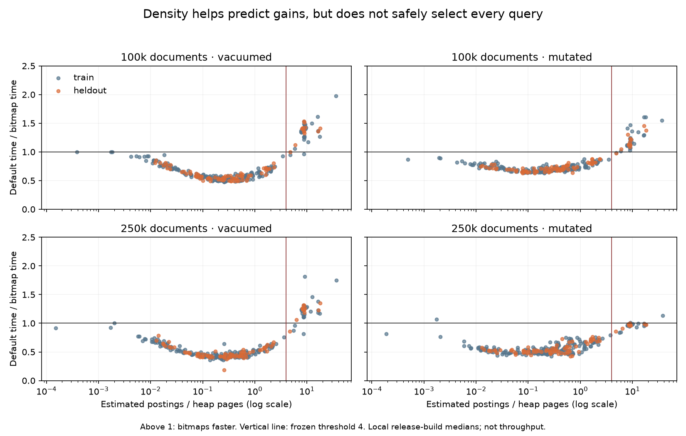

# COUNT strategy crossover: density is useful but insufficient

Do not enable the fitted density-only rule. It passed the first local held-out
comparison but failed transfer to a larger, recently mutated dataset.

## Protocol

The complete published Wikipedia trace contributes 302 OR COUNT shapes. A fixed
SHA-256 split assigned 215 queries to training and 87 to holdout before timing;
the six previously inspected queries were forced into training. No duplicate
canonical OR term sets occur in this trace. Each corpus size used four phases:
vacuumed, vacuumed repeat, committed mutations, and another VACUUM.

Each query has nine alternating default/forced-bitmap repetitions, full-count
agreement and an independent token-set reference on 1,000 rows. Both modes must
use the Stannum Count executor. The benchmark records server-side EXPLAIN ANALYZE
execution/planning times, buffers, heap fetches and actual strategies. A persistent
backend is used, unlike the earlier six-query fresh-backend diagnostic.

Both datasets are prefixes of the same published corpus, not independent
corpora. The 100k prefix has three immutable segments; the 250k prefix has eight.
The installed extension matched the release artifact from commit
`54c2d9e52fe5bbabc38e0e98829207d62b1f48cf`; PostgreSQL is Homebrew 18.6 on ARM macOS.
There are 43,488 timed executions across both sizes, plus untimed correctness
checks. All accepted runs completed with no correctness mismatches. The owned
local clusters were removed afterward. Two failed 250k preparation attempts are
excluded (oversized CSV field / incorrect empty-string quoting); the accepted
input uses the existing `published_dataset.prefix` loader.

## Features and fit

Features are collected outside timing: unique terms, summed per-term planner row
estimates, whole-query row estimate, heap pages, and immutable segment count.
Planner estimates use existing index document-frequency statistics. They are
not exact physical posting counts: PostgreSQL clamps/rounds row estimates, and
this does not expose encoding forms or actual populated-page counts.

A fixed small grid tests thresholds for estimated postings per heap page and
minimum unique terms. Only training queries from the 100k vacuumed and mutated
phases participate in fitting. Candidate policies with a training regression
exceeding both 10% and 0.05 ms are rejected; among survivors, minimize summed
per-query medians. Actual matches, heap fetches and timings are labels/outcomes,
not selector features. Forcing a page path already selected by default receives
no simulated credit.

The selected policy was: preserve default selection unless summed per-term
estimated rows / heap pages >= 4. The minimum width selected was one, so width
adds no restriction. It would force pages for 41 of 302 queries. The policy was
frozen before collecting the 250k measurements and was not retuned afterward.

## Held-out results

These ratios are default summed medians / simulated selected summed medians,
with equal weight per query. They are not measured throughput, and they exclude
the cost of implementing/consulting a selector. Greater than one favors the
candidate; less than one is a regression.

| Phase | 100k ratio | Material regressions | 250k frozen ratio | Material regressions |
| --- | ---: | ---: | ---: | ---: |
| Vacuumed | 1.226x | 0 | 1.142x | 1 |
| Vacuumed repeat | 1.210x | 0 | 1.129x | 1 |
| Mutated | 1.127x | 0 | 0.976x | 2 |
| Revacuumed | 1.308x | 0 | 1.243x | 0 |

For example, the held-out `books on cd` query regressed from 1.877 to 2.195 ms on
the vacuumed 250k prefix and from 19.672 to 22.920 ms after mutations. Training
query `pump it up` also regressed repeatedly. The existence of an aggregate gain
in other phases does not make these query-level regressions acceptable.

## What this establishes, and next work

Density predicts much of the sparse/dense crossover, but cannot safely choose
alone. A useful next hypothesis is how concentrated the posting volume is in
one term: `books on cd` has about 94% of estimated postings in `on`, whereas the
widest query's largest term contributes about 22%. This is descriptive evidence,
not a newly validated rule. Segment count, encoded body bytes/populated pages,
and visibility/heap-fetch cost also deserve measurement. Do not retune on these
held-out outcomes and present them again as untouched validation.

Next: instrument the missing cheap per-source metadata, test a conservative
candidate behind a diagnostic control, measure its actual decision overhead,
and validate on newly reserved workloads/scale before making it default. Keep
small-query latency, partial visibility, mutations and existing bitmap decisions
as regression gates. These results apply only to OR COUNT, not AND, ranking,
phrases or arbitrary Boolean queries. Shared-machine noise and single-host
measurements prevent production or TIN performance claims.

The earlier AWS six-query probe failed before timing because its materialized
correctness query exceeded the timeout. Evidence was saved and temporary AWS
resources deleted. No AWS crossover validation or CPU-profile result is claimed;
fix that validation path before paying for another run.

## Artifacts and reproduction

`count-crossover/measurements.csv` contains all query medians and feature values;
selection JSON files retain the fit and failed transfer evaluation; provenance
retains input/library hashes and visibility/segment snapshots. Full plans and
raw repetitions remain under `benchmarks/results/local-count-crossover-100k/`
and `benchmarks/results/local-count-crossover-250k-r3/`.

Run `count_local.py` with `--crossover-queries` pointing to the published
queries.json and a verified `--release-library`. The Python interpreter needs
psycopg. Use `count_crossover_report.py ROOT --output NEW_DIRECTORY` for fitting,
then `--fixed-rule ORIGINAL_SELECTION_JSON` for transfer evaluation without
retuning. The runner holds the local PostgreSQL installation lock.

Five crossover unit tests cover split stability, training/holdout isolation,
regression fallback, materiality thresholds, and avoiding simulated gains from
forcing an already-selected bitmap path. Full Python harness: 167 tests pass.
