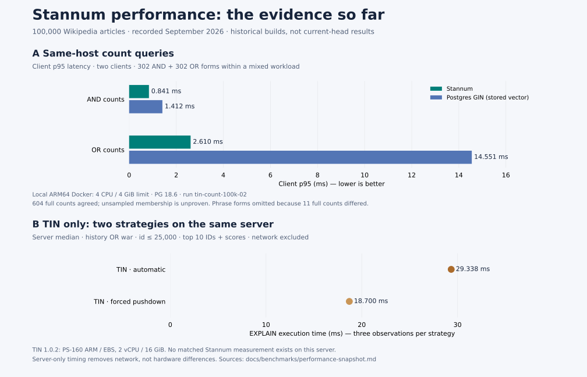

# Performance snapshot: GIN and remote TIN

Stannum is in a useful latency range on these recorded workloads: lower count
p95 than stored-vector GIN on the same host, and milliseconds to tens of
milliseconds for a selected filtered-ranking query across the local and remote
setups. This is **not** a current-head benchmark, a TIN speedup claim, a capacity
estimate, or a percentage of performance parity. One query cannot characterize
an engine. New optimizations need their own repeated measurements.



Download the [PNG](performance-snapshot.png) for sharing or [SVG](performance-snapshot.svg)
for scalable export. The graphic carries its limitations so a detached image
still identifies the different metrics, hardware and historical builds.

## A. Same-host count latency

The [published-trace results](published-trace-results.md) and
[source JSON](published-trace-results.json), run `tin-count-100k-02`, supply:

| Query family | Stannum client p95 | Postgres stored-vector GIN client p95 |
| --- | ---: | ---: |
| AND counts | 0.841 ms | 1.412 ms |
| OR counts | 2.610 ms | 14.551 ms |

This is the second integration observation, with GIN measured first. Both
engines used PostgreSQL 18.6, native ARM64 Docker, a four-CPU / 4-GiB server limit,
1 GiB shared buffers, 100,000 normalized Wikipedia articles, two clients,
ten seconds of warmup and sixty seconds of measurement. Other local services
remained running. The server CPU limit is not a hardware equivalence claim.
Client and Docker host CPU models are not recorded in this compact evidence.

There were 302 base queries, each executed as AND, OR and phrase forms. These
are family p95 values from the mixed workload, not dedicated AND/OR-only runs.
All 604 AND/OR full-corpus counts agreed; equal counts do not establish equal
membership on unsampled rows. Eleven phrase full counts differed, so phrase
latencies and aggregate mixed-workload throughput are intentionally omitted.
GIN uses stored tsvectors; total relation storage therefore differs. This is a
specific PostgreSQL FTS configuration, not every possible GIN deployment.

The measurement predates later planner improvements. Frozen source SHA-256:
`04d27d986bb5291d0c84276beee645006753df6666aea9ffe808fdfb0fb54985`.
Image and driver identities remain in the source JSON. A fresh paired run on
current main is required before describing these as current release numbers.

## B. Remote TIN as a scale reference

The selected query returns IDs and scores for `history OR war`, restricted to
`id <= 25000`, ordered by descending score with literal LIMIT 10 and OFFSET 0.
The filter selects 25% of the corpus before text matching. Both datasets have
100,000 rows and the same `documents.csv` SHA-256:
`d01f490c802313190924a1edd1722d9b1c543793a8ccd0950108d813cb8b7da1`.

| Observation | Server execution time | Sampling |
| --- | ---: | --- |
| Stannum baseline `07fedc6` | 5.178 ms | Median of run medians 5.100 / 5.256 ms; seven retained samples each |
| TIN 1.0.2 automatic | 29.338 ms | Three observations; 29.006–30.750 ms |
| TIN 1.0.2 forced TID pushdown | 18.700 ms | Three observations; 18.669–18.785 ms |

Stannum comes from `or_p25_literal` in
[filtered-prefix-results.json](filtered-prefix-results.json). It is the baseline,
**not the rejected retry candidate**. TIN comes from run `visible-s4-m16` in
[tin-expanded-results.json](tin-expanded-results.json), groups
`forced:wiki:0.25:10:r*:{}` and
`forced:wiki:0.25:10:r*:{'tin.debug_force_conjunction_mode': 'Pushdown'}`.
Raw TIN automatic SQL/plans are artifacts `00294`, `00303`, `00309`; pushdown
artifacts are `00293`, `00300`, `00308` under the retained local directory
`benchmarks/results/tin-visible-s4-m16`. The dataset hash was also verified
against that directory's `experiment.json` manifest. No live service was queried
for this graphic.

| Condition | Stannum local baseline | Remote TIN |
| --- | --- | --- |
| Server | Native ARM64 Docker, four-CPU / 4-GiB limit | PS-160 ARM, EBS, 2 vCPU / 16 GiB (user-reported) |
| PostgreSQL | 18.6 | 18.6 |
| Shared buffers / work_mem | 1 GiB / 16 MiB | 2 GiB / 2 MiB for these probes |
| Planning | Forced generic prepared text parameter; literal bound | Literal SQL |
| Timing | EXPLAIN ANALYZE with node timing | EXPLAIN ANALYZE, TIMING OFF |
| Visibility | 10,467 / 10,496 heap pages all-visible | 9,801 / 9,856 heap pages all-visible |
| Complete relation | 362,110,976 bytes | 392,290,304 bytes |
| Layout | Baseline build; segment target 32,768 documents | Four immutable segments, 16 MiB build memory |

The normalized corpus's bodies before its mutable suffix have median 1,296 bytes,
p95 10,121 bytes and maximum 58,221 bytes, per the dataset manifest. Physical
layout differs despite identical input bytes. The TIN disk configuration was
10–4,096 GiB; this is a provisioning range, not observed disk use.

Both timings exclude client network transfer and are warm observations; neither
establishes cold-storage behavior. They differ in CPU resources, memory,
PostgreSQL settings, planning, instrumentation and physical layout. No
cross-engine score or relevance equivalence is established here. Stannum is
checked against exhaustive same-engine scoring in that campaign; TIN's forced
strategies are checked against its own score sequences. Lead remains the
independent compatibility oracle.

The right conclusion is narrow: **this selected shape is in the millisecond to
tens-of-milliseconds range in both setups**, so it is useful evidence that we are
investigating a plausible performance range. It cannot tell us which engine would
win on identical machines, or whether Stannum matches TIN across workloads.
For broader remote observations, including one million articles, see
[the expanded experiment report](tin-expanded-experiments.md).

## Re-render

The generator reads existing checked-in source JSON directly; it does not embed
copied timing constants or run benchmarks. Use Python with Matplotlib 3.11.2:

```sh
python3 docs/benchmarks/render_performance_snapshot.py
```

It writes the PNG and SVG beside this document. Before reusing it for a release,
refresh the same-host GIN comparison on the release revision with equal corpus,
query set, visibility, settings and offered load. Keep remote TIN observations
separate unless an actually matched experiment becomes available.
