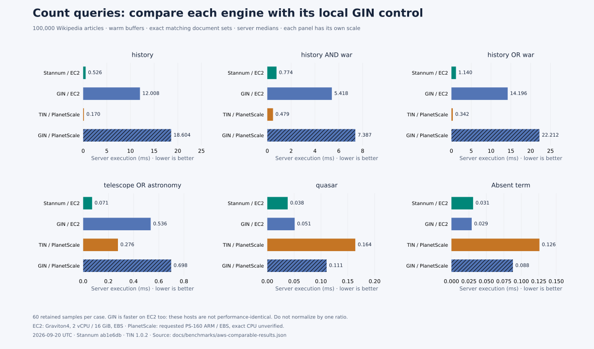
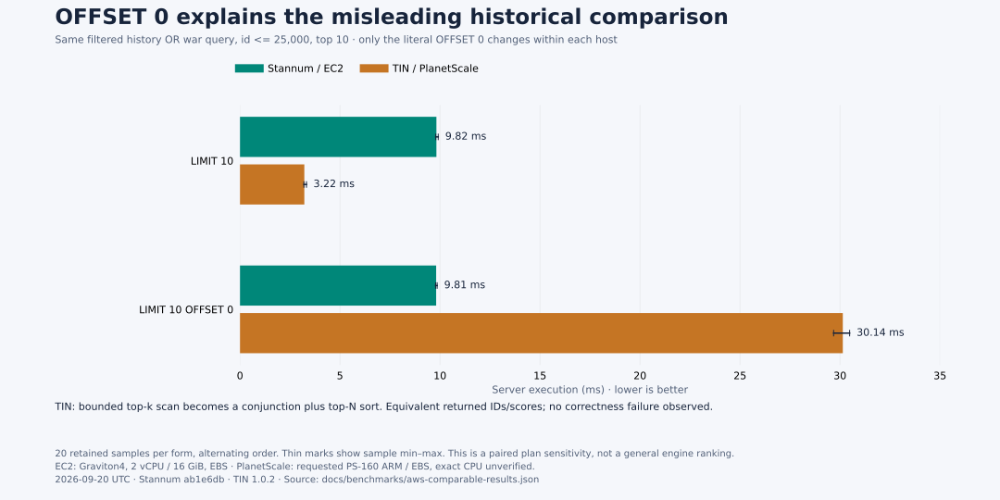

# Performance snapshot from the matched AWS experiment

These graphics use the [September 20 AWS measurements](aws-comparable-results.md),
not the earlier Mac client-p95 measurements. Every latency is server execution time
with warm buffers. The source is [committed result JSON](aws-comparable-results.json).
Stannum was measured at `ab1e6db`, TIN reports 1.0.2, and both use PostgreSQL 18.6.

## Ranked top ten


[PNG](performance-snapshot.png) · [SVG](performance-snapshot.svg)

* Unfiltered ranking is close on several shapes. Common OR is 3.553 ms for Stannum
  versus 2.463 ms for TIN. Small observed Stannum wins on other shapes do not establish
  an engine advantage because the hosts are not performance-identical.
* The biggest absolute gap here is filtered common OR at `id <= 25000`: 9.844 ms
  versus 3.246 ms, about 3.0× slower for Stannum. Common-term and AND ranking with
  that filter are about 2.0× and 1.7× slower respectively.
* Selective OR with `id <= 1000` reverses the pattern: Stannum is 0.284 ms versus
  TIN's 1.159 ms. Strategy selection and selectivity matter; one average would hide
  the different behaviors.

The three panels share an axis and query order. Bars show medians of 60 retained
samples per case across three rounds. Thin marks show the range of the three round
medians, not confidence intervals. These queries have no OFFSET. ID ranges describe
SQL filters, not the fraction of text matches that qualify.

## Counts and GIN controls



[PNG](performance-counts.png) · [SVG](performance-counts.svg)

Stannum's same-host advantage over stored-vector GIN is approximately 23× for
`history`, 7× for AND, and 12.5× for common OR. The absent-term case is essentially
a tie at tens of microseconds. This is not a claim about all GIN workloads.

TIN is faster than Stannum on the common-term counts: about 3.1× for `history`,
1.6× for AND, and 3.3× for common OR. Stannum's observed times are lower for selective
OR and the tiny rare/miss lookups. Each panel has its own clearly labeled scale to
keep sub-millisecond cases readable; compare lengths within a panel.

The GIN controls expose remaining host differences. For the substantial matching
count shapes, GIN is about 1.3–1.6× faster on EC2; tiny queries show different ratios.
Do not multiply all timings by a single normalization factor. Counts use an indexed
stored tsvector baseline, while ranked queries use native BM25-style full_score.
There is no equivalent GIN ranked series in these figures.

## Why the earlier graph was misleading



[PNG](performance-offset-zero.png) · [SVG](performance-offset-zero.svg)

The old filtered query included OFFSET 0. A controlled pair on the new fixture
shows TIN changing from 3.22 to 30.14 ms when only that literal clause is added;
Stannum stays around 9.8 ms. TIN switches from its bounded top-k path to a conjunction
plus top-N sort. This is a possible missed optimization, not a result-correctness
failure and not representative of TIN's normal top-k performance.

These bars use the separate paired experiment: 20 retained samples per form after
five warmups, alternating order. Thin marks show sample min–max, not the round-median
ranges of the ranked overview. The paired medians differ slightly from the broader
campaign because they are separate observations.

## What to optimize next

Prioritize the filtered-ranking exhaustive fallback. In the representative common
OR plan Stannum initially scores 548 candidates, then performs 27,946 exhaustive
score calls while fetching only 34 heap rows. The prior resumable-frontier prototype
was slower despite fewer score calls; improve its repeated document lookup cost
before retesting. Common-term count execution is the next clear gap to investigate.
Keep selective and rare cases as regression checks rather than optimizing only the
largest bars.

All 54 validation checks passed. Across five scored shapes, 55,741 document-score
pairs matched bit-for-bit between engines. These are 100k-document, single-client,
warm-buffer observations. They do not establish cold-cache, sustained-write,
concurrent-throughput or production-scale performance.

EC2 used Graviton4 with 2 vCPU / 16 GiB and gp3 EBS. PlanetScale was requested as
PS-160 ARM/EBS; its exact CPU and storage allocation were not independently exposed
by SQL. PostgreSQL build/compiler and managed-service details also differ. Relevant
memory/planner settings, data types and LZ4 text compression were matched. Both AWS
instance and disk have been deleted; rendering these charts requires no databases.

Rebuild all three PNG/SVG pairs with matplotlib installed:

```sh
python3 docs/benchmarks/render_performance_snapshot.py
```

The earlier observations remain available in the [published-trace report](published-trace-results.md)
and [TIN experiments](tin-expanded-experiments.md). They use different workloads,
sampling and settings and must not be plotted as before/after improvement here.
