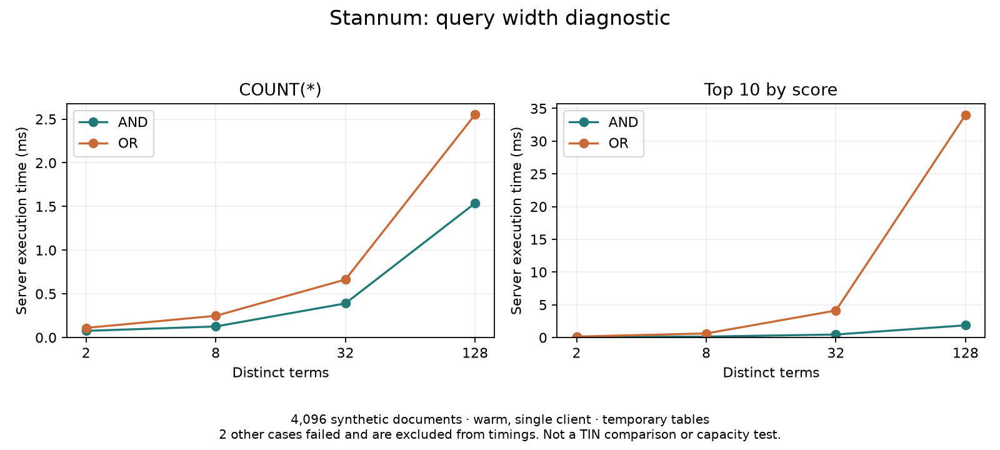

# Query complexity and SQL integration

This suite complements the [published PlanetScale trace](published-trace.md).
It asks which query shapes work, which execution paths they select, and how
planning/execution costs change with query width. It does not measure production
capacity or reproduce PlanetScale's published results.

## Run

Install the extension in an existing disposable database, then use libpq environment
variables for the connection. The suite creates only session-local temporary tables.
It does not create extensions, overwrite application tables, or provision servers.

```sh
python3 benchmarks/query_shapes.py --engine stannum --rows 4096 \
  --repetitions 7 --discard 2 --output benchmarks/results/shapes-01
```

`--engine tin` generates the same fixture and TinQL with TIN scoring. That mode
is prepared for the next remote comparison; it has not been run against TIN.
`--generate-only` exports the catalog and a `server_times.py --sql-cases` input
without connecting. The exported timing input alone does not perform correctness
validation; run this entry point for the checks. No GIN translation is supplied
for arbitrary TinQL: it would change semantics. Use the existing published-trace
adapter for the stored-vector GIN comparison.

There are 44 cases:

- Distinct-term AND and OR at widths 2, 8, 32, and 128, both count and top-10.
- Nested AND/OR, exclusion, redundant clauses, contradictions, phrases, phrase
  disjunctions, prefix expansion, rare/common mixtures, and absent terms.
- Ranked EXISTS, NOT EXISTS, correlated subqueries, joins, sparse filters, and
  materialized CTEs; lateral rescans and UNION ALL counts.

The synthetic documents contain a deterministic mixture of 128 alphabetic terms.
Every seventeenth document contains all terms, so long conjunctions do not simply
become empty-result tests. A separate term appears every 97 documents. Every row
has a stable numeric ID. This deliberately controlled distribution is different
from natural language and must remain labeled in graphics.

## Correctness and failure behavior

Membership is compared in both directions with independent SQL predicates over
raw text. Counts are also checked against that reference. Ranking is checked
against a materialized, unlimited same-engine score result, comparing exact float4
score multisets including multiplicity, plus unique IDs and membership. Ties may
select different IDs. The materialized-CTE case is a timing/control case whose
ranked reference is identical; its membership check is still independent.
This is not an independent BM25 calculation, a score-order assertion, or LED
compatibility validation. Keep the separate 15-minute LED gate.

Each statement is materialized separately during validation to avoid changing its
planner context by embedding it in a set operation. Errors are recorded per case,
with SQLSTATE and message; other cases continue. Failed cases have standalone SQL
reproductions and receive no timing. The command exits nonzero if any case fails.
Timing errors also fail the run. Failed cases must appear in published coverage
counts; never treat them as zero latency or silently omit them from comparisons.

For successful cases, the existing server timer runs interleaved EXPLAIN ANALYZE
with TIMING OFF, retaining raw plans, planning times, server execution times,
plan-node/provider coverage, and candidate strategies when exposed. Raw plans
also retain buffers and any node-specific memory counters PostgreSQL supplies;
this is not a complete measurement of backend peak memory. The run records
fixture fingerprint, server version/settings/extensions, exact SQL, and benchmark
source hashes. Record deployment image/hardware separately. Connection secrets
are not written into the catalog.

## First local diagnostic

The committed [results](query-shapes-results.json) and
[correctness outcomes](query-shapes-correctness.json) use 4,096 documents,
seven repetitions with two discarded, one client, a Docker server limited to four
CPUs and 4 GiB, and temporary tables. The image was `stannum-bench:frontier-baseline`,
engine commit `a0c6bd696910c89812e567c552865972515f8771`. Its `postgres/` and
`segment/` sources match main `f641dbe`; the experimental frontier is absent.
Unrelated host services were running. These are diagnostic observations, not
statistical claims or a comparison with TIN.

42 of 44 cases pass. Ranked EXISTS and NOT EXISTS fail with SQLSTATE XX000:
`stannum.full_score() requires a stannum index scan and cannot be used in this query context`.
The EXISTS failure also reproduces as the original standalone SELECT, outside
validation wrappers. [Standalone reproduction](query-shapes-exists-repro.sql).

The 128-term ranked OR takes roughly 34.0 ms versus 0.14 ms at two terms on this
fixture. The lateral count uses a sequential scan and takes roughly 118.4 ms.
These identify investigation targets, not proof that the same ratios apply to
real documents. Ordinary wide AND/OR cases do select Stannum custom scans.



Regenerate the graphic with matplotlib installed:

```sh
python3 docs/benchmarks/render_query_shapes.py \
  docs/benchmarks/query-shapes-results.json docs/benchmarks/query-shapes-width
```

## PlanetScale benchmarker and publication protocol

We already use the actual PlanetScale fork through `benchmarks/tin.py`, not a
replacement load generator. On this audit, `git ls-remote` still identifies the
`datasets` branch as `f487fbaaf5039a7b92e1de4efb40e0f7c6fcdb86`, matching our pin.
Its main branch is not the dataset/driver branch used by our integration.
See the [source audit](tin-benchmark-source-audit.md) for branch identities,
corpus checksums, adapter departures, and the trace-count discrepancy.

The [announcement](https://planetscale.com/blog/introducing-tin#tin-performance-and-benchmarking)
uses an 85 GB, 150-million-document Stack Exchange dataset for most charts;
PostgreSQL containers had eight vCPUs and 32 GB RAM on an i7i.8xlarge with local
NVMe. Reusing its driver with our Wikipedia sample does not reproduce that result.
Our existing adapter uses its public query trace on a different Wikipedia corpus.
Do not put their published TIN numbers beside our local timings as matched bars.

For the next article and comparison:

1. Keep this diagnostic suite and the published trace separately labeled. Freeze
   fixture hashes, engine versions, SQL, driver revision/patches, and settings.
2. Fix or explicitly list unsupported cases before selecting a representative mix.
   Run identical supported SQL against TIN and Stannum and check membership/scores.
3. Use matched resource limits, storage and client placement. Run server-time
   diagnostics separately from k6 client latency/QPS; do not infer QPS by taking
   the reciprocal of EXPLAIN time or compare it to k6 throughput.
4. Repeat alternating engine order. Include resident and memory-pressure datasets,
   query-width families, and a declared offered load/concurrency sweep. Report
   failures, completed writes, observed coverage, and timeout rates.
5. For writes, reuse the existing contention/mutation harnesses: inserts, updates,
   deletes, maintenance, and long readers. Verify source count and active path;
   extra segments disable the current experimental frontier. This suite's temp
   tables cannot measure cross-session visibility, row-lock waits, or durability.
6. Plot per-family latency and throughput/latency versus load, with sample counts
   and run variation. Keep p99 out of tiny samples; show unsupported cases explicitly.

Remaining coverage: fuzzy/regex/proximity expansion stress, deeply nested trees,
large OFFSET/K and secondary orderings, cross-session isolation/locking, partitioned
ranked queries, and sustained mixed traffic. Existing correctness tests/harnesses
cover parts of these, but this new matrix does not claim comprehensive coverage.

## Follow-up validation

A 16,384-document run (three observations, one discarded) reproduced the same
42 passes and two EXISTS/NOT EXISTS errors. Its [results](query-shapes-16384-results.json)
are diagnostic, with only two retained observations per case.

A fresh [PlanetScale/k6 integration smoke run](query-shapes-upstream-smoke.md)
completed for Stannum and GIN, exercising all 906 trace forms. One count
disagreement means this is not an equivalent-result performance comparison.

Raw evidence archive: `benchmarks/results/query-shapes-evidence.tar.gz`, SHA-256 `56da2d8b0dd5f8b46cfc778b29736f4c36d3cb68a41bfb5a32ae7e5c44cb1951`. It contains full plans, SQL catalogs, failures, fingerprints, and upstream outputs.
